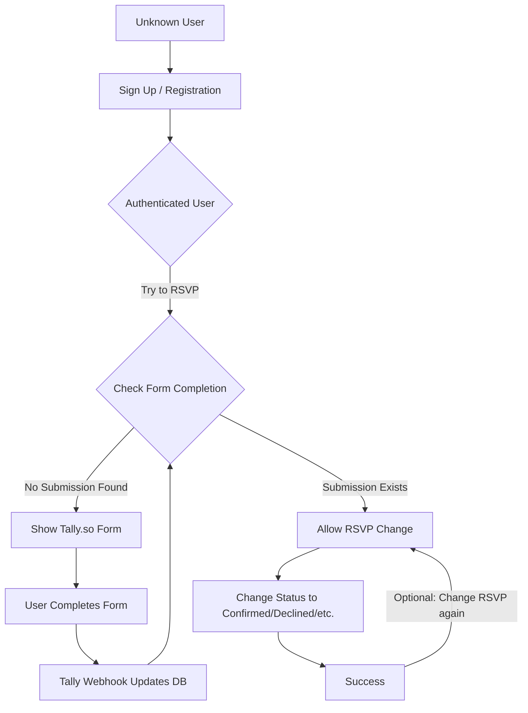

# User Signup and RSVP Flow

This document details the process for a new user signing up on the platform and successfully RSVPing to an event.

## Flow Diagram

## Detailed Process

1.  **Sign Up**: An unknown user creates an account on the website.
2.  **Authentication**: The user is now authenticated and can access their profile/dashboard.
3.  **RSVP Attempt**: When the user tries to set their RSVP status (typically to "Confirmed"), the system checks if they have completed the required **Tally.so** form.
    *   **Logic**: This is enforced via a database trigger `on_profile_rsvp_update` which raises an `RSVP_FORM_REQUIRED` exception if no entry exists in the `event_form_submissions` table for that user.
4.  **Form Requirement**: If the form hasn't been completed, the user is redirected or prompted to fill out the Tally.so form.
5.  **Form Completion & Webhook**:
    *   Once the user submits the form, Tally.so sends a webhook to the `/api/webhooks/tally` endpoint.
    *   The webhook verifies the signature and records the submission in the `event_form_submissions` table.
6.  **Unlocking RSVP**: Once the submission is recorded, the database trigger allows the user to change their `rsvp_status` to "Confirmed".
7.  **Future RSVP Changes**: After the form is completed once, the requirement is satisfied. The user can subsequently change their RSVP status to whatever they like (e.g., changing from "Confirmed" to "Declined" and back) without being blocked by the form requirement again.
